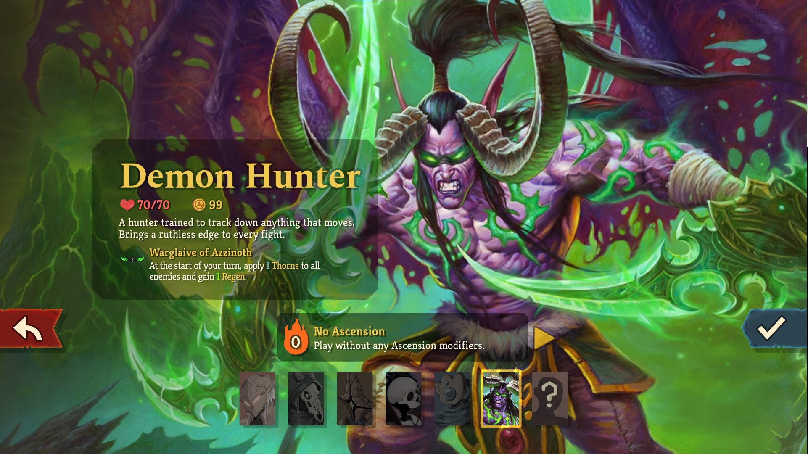
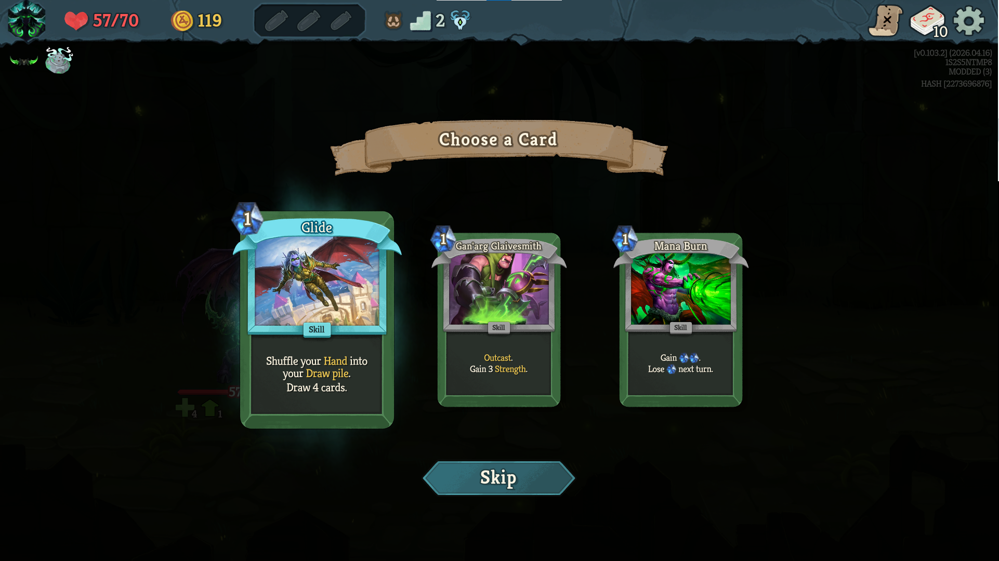
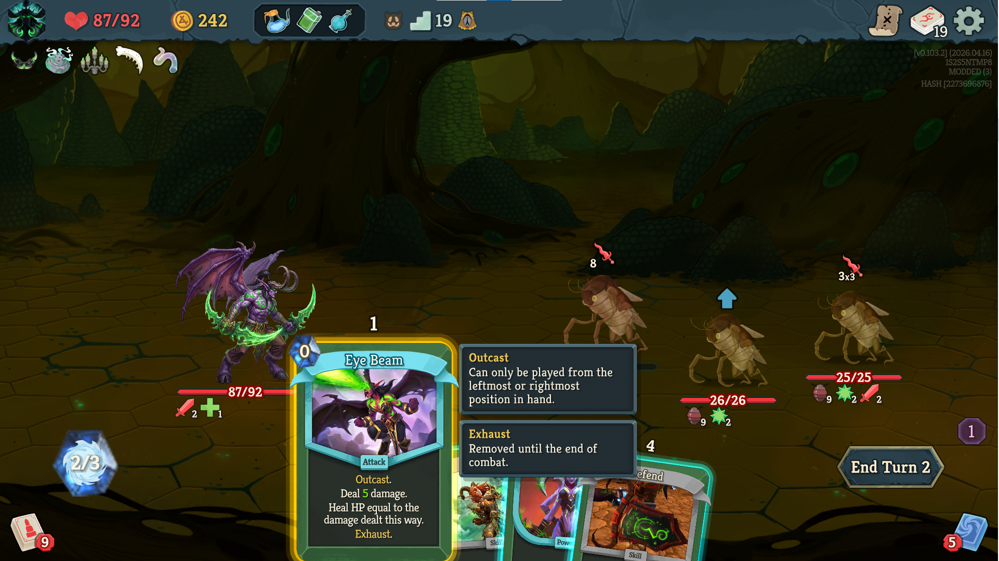
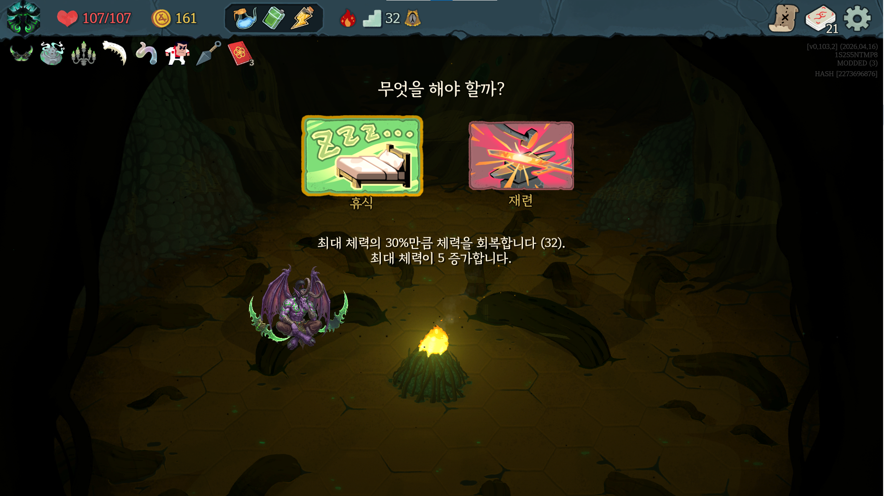
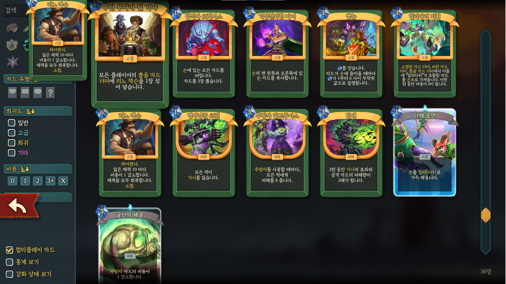
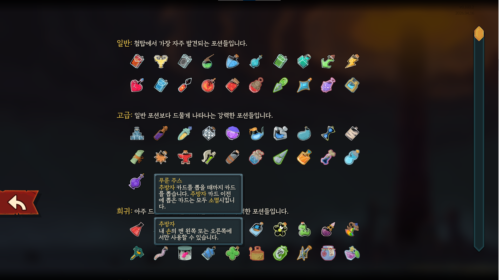
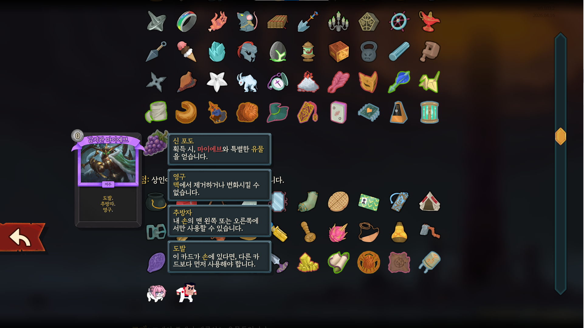

# Slay the Spire 2 MOD: Demon Hunter Illidan Stormrage
[한국어 문서 링크](res/README.md)  
A fan MOD that adds the `Demon Hunter` `Illidan Stormrage` from `World of Warcraft` and keywords from `Hearthstone` to [`Slay the Spire 2`](https://store.steampowered.com/app/2868840/Slay_the_Spire_2/) (hereinafter StS2).

## Character Concept
High Risk, High Reward  
Play strategically as a character that grows stronger alongside enemies as turns progress.

## New Keywords
- Outcast  
  Can only be played from the leftmost or rightmost position in your **hand**.
- Highlander  
  Can be played if there are no duplicate cards in the **draw pile**.
- Taunt  
  If this card is in your **hand**, it must be played before other cards.

## Recommended Play Strategies
- Illidari  
- Outcast  
- Highlander  

## How to Install the Mod
1. Open the local folder where StS2 is installed (Windows default path: `C:\Program Files (x86)\Steam\steamapps\common\Slay the Spire 2`), and create a mods/ folder if it doesn't exist.
2. **(Required)** Download [BaseLib](https://github.com/Alchyr/BaseLib-StS2/releases) and extract it to the mods/ folder. (MOD files typically contain .dll, .json, and .pck files.)
3. Download [DemonHunterMOD](https://github.com/c2lv/DemonHunterTest/releases) and extract it to the mods/ folder.
4. **(Optional)** By default, save files with the MOD applied are stored separately from those without. It is recommended to also extract [UnifiedSavePath](https://www.nexusmods.com/slaythespire2/mods/6) to the mods/ folder to unify these save paths.

## In-Game Screenshots

## Bug Reports
There are still many areas for improvement. Please submit pull requests or issues.

## Supported Languages
English, Korean

## Other
The developer of this service has no relation to the developers of World of Warcraft or Hearthstone.
All resources used in the game are owned by Blizzard Entertainment.
